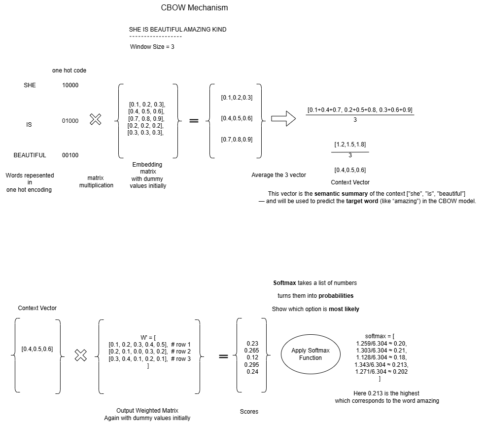
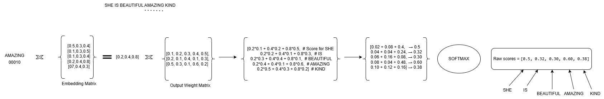
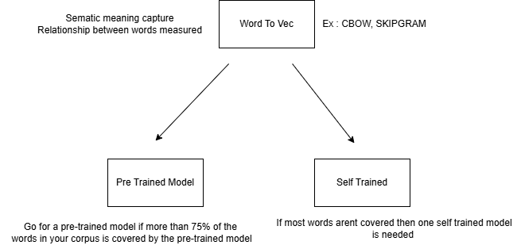

# 🧠 All About NLP – Feature Engineering & Term Analysis

Welcome to my NLP research and experimentation space.

My journey into Natural Language Processing began in 2022 while exploring data science concepts. I hold a Master’s degree in Information Science from the **University of Pittsburgh**, where I focused on courses in **Machine Learning, Natural Language Processing, Cloud Computing**, and **Database Systems**, along with several elective subjects that deepened my technical foundation.

### 🎯 Objective

The goal of this repo is not just to support my own learning, but to serve as a reference point for anyone preparing for NLP interviews. If you're reviewing core topics or looking for clean, example-driven notebooks — this space is built for you.

## ✅ Work Done So Far

Notebook: Basics.ipynb
- Applied **lemmatization** to normalize tokens
- Removed **stopwords** and **punctuation** to clean the text
- Used **CountVectorizer** to extract word-level features
- Performed **TF-IDF with n-grams** (unigrams, bigrams) to understand frequent and meaningful semantic terms

These steps help surface the most informative patterns in the dataset and prepare the text for downstream modeling.

## TFIDF , CountVectorizer 
- They help us determine the frequency of words in a document but cant help us determine the relationship between words

## CBOW 
Notebook: Word2Vec.ipynb
- Continuos bag of words is used to convert words into meaningful vectors  
in simple words representing words with  unique numerical values that are relative to each other

- Here we use a set of words in a sentences to predict one context word

## SKIP GRAM 
- Here we predict a set of words based on the context word 

How to choose Word To Vec

